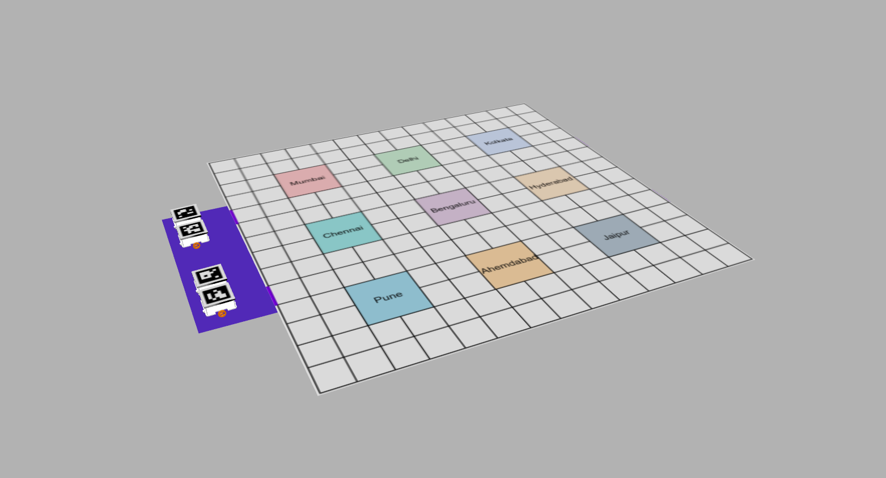
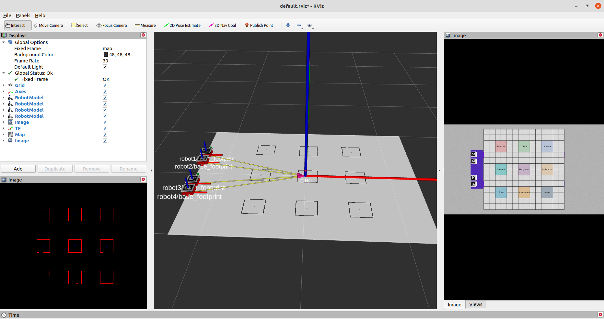

# flipkart GRiD3 Robotics challenge 
This project is a solution to the problem statement provided by flipkart GRiD 3.0

# Clone repo instructions
```sh
git clone --recurse-submodules https://github.com/shivam675/flipkart-GRiD3.git
```

# Create Markers:

**1. use the createmarkers.py node in make_markers package :**


### How to build:
- In terminal `catkin_make -DCMAKE_BUILD_TYPE=Release -j4`
- ADD the following line in .bashrc file
- `export GAZEBO_MODEL_PATH=/home/{your_user_name}/catkin_ws/src/rover_sim/models`
- 

### How to run:
#### FOR IRL
<!-- 1. To open arm in Gazebo | Terminal 1: `roslaunch arm_gazebo gazebo_spawn.launch` -->
<!-- 2. To open arm in Rviz   | Terminal 2: `roslaunch arm_prismatic_octomap bringup.launch` -->
1. Run **ros_camera.launch** file | Terminal 1 (camera_driver): `roslaunch camera_driver ros_camera.launch`
2. Run **aruco_detect_ros.launch** fine | Terminal 2 (aruco node): `roslaunch make_markers aruco_detect_ros.launch`

#### FOR SIMULATION

1. Run **ros_camera.launch** file | Terminal 1 (camera_driver): `roslaunch rover_sim gazebo_spawn.launch`
2. Run **aruco_detect_ros.launch** fine | Terminal 2 (aruco node): `roslaunch make_markers aruco_detect_ros.launch`

# Tested on System config 1:
- Hardware: i3 quad thread AMD64
- ROS: Melodic
- OS: Ubuntu 18.04 LTS
- processor arch: 2-core AMD64 Arch
- 8 GB 1666 MHz RAM

# Tested on System config 2:
- Hardware: Ryzen 7 AMD64
- ROS: Melodic
- OS: Ubuntu 20.04 LTS
- processor arch: 8-core AMD64
- 16 GB 3200 MHz RAM 


### How to run task 2:
1. Run **sim.launch** file | Terminal 1 (all_nodes): `roslaunch gods_eye activate_sim.launch`
<!-- 2. Run **aruco_detect_ros.launch** fine | Terminal 2 (aruco node): `roslaunch make_markers aruco_detect_ros.launch` -->

## SIM  



## RVIZ




# Done Part:
1. Camera calibration for intrensic and extrensic params
2. Multiple aruco_marker detection
3. python node to publish all the tfs of the aruco markers in ros


# To-do:
1. All major things related to navigation
2. Publishing confirm TF of each bot
3. extracting odom from encoders of the robot
4. Publishing fake laserscan from the 2d image